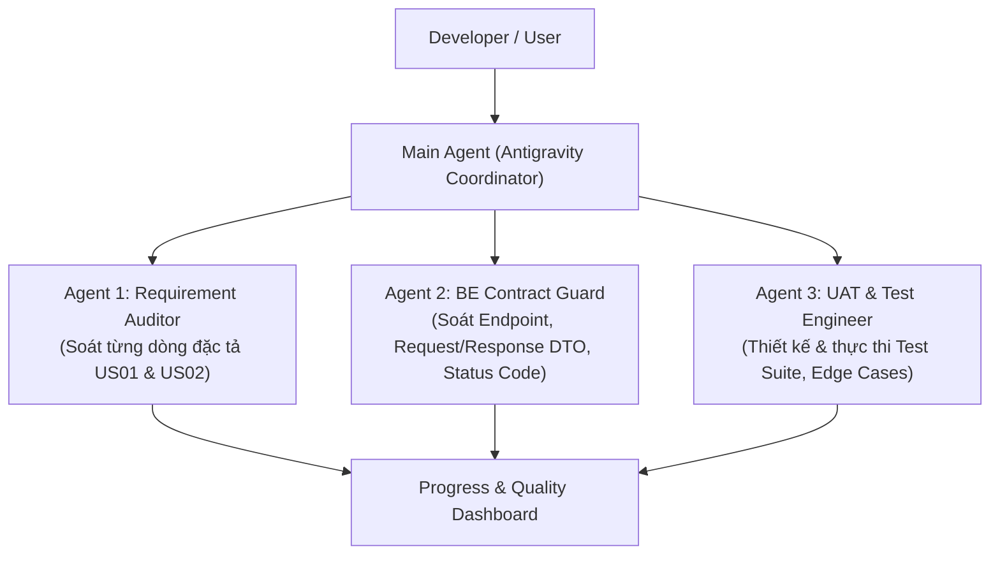
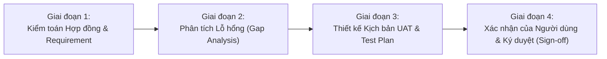

# Kế Hoạch Đảm Bảo Yêu Cầu & Tích Hợp Backend (PIM Tool Frontend)

> **Tài liệu tham chiếu chuẩn:**
> - Đặc tả nghiệp vụ: `On-boarding-PIMTool-Requirements-v4-Exercise.docx` / [`PIMTOOL_REQUIREMENTS.md`](file:///C:/Users/dptn/IdeaProjects/pilot-project-back/PIMTOOL_REQUIREMENTS.md)
> - Đặc tả API Backend: `C:\Users\dptn\IdeaProjects\pilot-project-back\API_SPECIFICATION.md` & [`ProjectController.java`](file:///C:/Users/dptn/IdeaProjects/pilot-project-back/src/main/java/vn/elca/training/controller/ProjectController.java)
> - Trạng thái: **DRAFT / PLAN ONLY (Chưa thực hiện thay đổi code)**

---

## 1. Hệ Thống Subagents Chuyên Biệt (Multi-Agent Team)

Để kiểm soát chất lượng từ góc nhìn đặc tả, hợp đồng API và kiểm thử, ta phân chia 3 vai trò agent:

| Agent | Vai trò & Trách nhiệm chính | Tiêu chí đầu ra |
| :--- | :--- | :--- |
| **`pim-req-auditor`** | Rà soát từng câu chữ trong tài liệu yêu cầu (US01, US02) đối chiếu với code UI và thông báo lỗi. | Ma trận đối soát tính năng (Requirement Traceability Matrix). |
| **`be-contract-guard`** | Kiểm tra tính tương thích 100% giữa Axios calls và Spring Boot Controller (`@GetMapping`, `@PostMapping`, `@PutMapping`, `@DeleteMapping`, DTO, Query Params, Validation). | Báo cáo kiểm định hợp đồng API (API Contract Audit Report). |
| **`uat-test-engineer`** | Xây dựng các kịch bản kiểm thử hành vi người dùng (User Journey), mock đúng cấu trúc backend và bảo đảm test coverage. | Bộ test tự động (Unit + UAT) xanh 100%, không bị flaky. |

---

## 2. Kỹ Năng Chuyên Sâu (Specialized Skills)

1. **`api-contract-checker`**:
   - Tự động so sánh tên trường giữa Frontend payload (`src/services/projectService.jsx`) và Backend Java DTO (`CreateProjectRequest`, `UpdateProjectRequest`, `SearchProjectCriteria`, `ProjectDetailResponse`, `ProjectListResponse`).
   - Kiểm tra định dạng ngày (`YYYY-MM-DD`), kiểu dữ liệu (`Long` vs `Integer` vs `String`), kiểm tra enum (`ProjectStatus`: `NEW`, `PLA`, `INP`, `FIN`).
2. **`ui-spec-validator`**:
   - Kiểm tra trạng thái component: `disabled` của `Project Number` khi Edit, hiển thị nút xóa chỉ cho `NEW`, format ngày hiển thị `DD.MM.YYYY`.
   - Kiểm tra đa ngôn ngữ: Đối chiếu mọi key trong `en.jsx` và `fr.jsx` với văn bản mẫu trong tài liệu Word.
3. **`uat-runner`**:
   - Chạy và phân tích kết quả Jest / React Testing Library với cấu hình tương thích `MutationObserver` và async act warnings.

---

## 3. Quy Trình Làm Việc Chuẩn (Workflow 4 Giai Đoạn)

- **Giai đoạn 1 (Audit)**: Đọc đối chiếu mã nguồn `ProjectList.jsx`, `ProjectForm.jsx`, `projectService.jsx` với Backend Spring Boot.
- **Giai đoạn 2 (Gap Analysis)**: Liệt kê danh sách các điểm còn vênh (nếu có) giữa FE và BE.
- **Giai đoạn 3 (Test Plan)**: Lập bảng kịch bản kiểm thử chi tiết từ mức giao diện đến mức API.
- **Giai đoạn 4 (Sign-off)**: Báo cáo kết quả cho User, chỉ tiến hành code khi User đã phê duyệt kế hoạch.

---

## 4. Ma Trận Đối Soát Tiêu Chí Chấp Nhận (Acceptance Criteria & Contract Matrix)

### US01: Tạo mới & Cập nhật Dự án (New & Edit Project)

| Mã AC | Tiêu chí chấp nhận (Requirement Specification) | Kỳ vọng Frontend | Hợp đồng Backend (Spring Boot) | Trạng thái hiện tại |
| :--- | :--- | :--- | :--- | :---: |
| **AC 1.1** | Tiêu đề màn hình thay đổi theo chế độ. | Tạo mới: `New Project` Chỉnh sửa: `Edit Project information` | Không liên quan BE | ✅ ĐÃ ĐẠT |
| **AC 1.2** | Số dự án (`Project Number`) bắt buộc, số nguyên dương, **KHÔNG ĐƯỢC SỬA khi Edit**. | New: Cho phép nhập. Edit: `disabled` / Read-only. | Backend `updateProject` không update `projectNumber`. | ✅ ĐÃ ĐẠT |
| **AC 1.3** | Màn hình Edit phải tự động tải thông tin dự án hiện tại. | Khi mount, gọi `GET /projects/{id}` và đưa vào form. | Endpoint `GET /projects/{projectId}` trả `ProjectDetailResponse`. | ✅ ĐÃ ĐẠT |
| **AC 1.4** | Trạng thái mặc định khi tạo mới là `NEW`. | `status: 'NEW'` trong `defaultValues`. | `status` enum: `NEW` | ✅ ĐÃ ĐẠT |
| **AC 1.5** | Suggestion box cho trường `Members`. | Hiển thị dropdown gợi ý Visa + Họ tên nhân viên khi gõ. | `GET /employees` trả danh sách nhân viên. | ✅ ĐÃ ĐẠT |
| **AC 1.6** | Kiểm tra bắt buộc: thiếu trường hiện thông báo đỏ. | Hiển thị banner: `Please enter all the mandatory fields (*).` | `@NotBlank`, `@NotNull` trên Request DTO. | ✅ ĐÃ ĐẠT |
| **AC 1.7** | Kiểm tra trùng số dự án: Báo lỗi trùng số. | Hiển thị: `The project number already existed. Please select a different project number` | Backend ném mã `DUPLICATE_NUMBER` (HTTP 400). | ✅ ĐÃ ĐẠT |
| **AC 1.8** | Kiểm tra VISA không tồn tại. | Hiển thị: `The following visas do not exist: {visas}.` | Backend ném mã `INVALID_VISAS` (HTTP 400). | ✅ ĐÃ ĐẠT |
| **AC 1.9** | Kiểm tra ngày kết thúc: `End Date > Start Date`. | Client Zod validate + BE validate `@StartBeforeEndDate`. | Lỗi `INVALID_END_DATE`: `End date must be later than Start date.` | ✅ ĐÃ ĐẠT |
| **AC 1.10** | Cập nhật dự án gửi đúng `id` và xử lý Optimistic Locking. | Gửi `PUT /projects/{id}` kèm trường `version`. | `UpdateProjectRequest` kiểm tra `@NotNull private Long version`. | ✅ ĐÃ ĐẠT |
| **AC 1.11** | Sau khi lưu thành công, quay về danh sách dự án. | Gọi `navigate('/')`. | HTTP 201 (Create) / HTTP 200 (Update). | ✅ ĐÃ ĐẠT |

---

### US02: Danh sách & Tìm kiếm Dự án (List, Search & Delete)

| Mã AC | Tiêu chí chấp nhận (Requirement Specification) | Kỳ vọng Frontend | Hợp đồng Backend (Spring Boot) | Trạng thái hiện tại |
| :--- | :--- | :--- | :--- | :---: |
| **AC 2.1** | Cột trong bảng danh sách dự án. | Checkbox, Number (Link), Name, Status, Customer, Start Date (DD.MM.YYYY), Delete. | `Page<ProjectListResponse>` | ✅ ĐÃ ĐẠT |
| **AC 2.2** | Chỉ dự án có trạng thái `NEW` mới có icon thùng rác (Delete). | Dòng có `status === 'NEW'` mới render nút thùng rác. | Backend `deleteProject`: kiểm tra `status == NEW`. | ✅ ĐÃ ĐẠT |
| **AC 2.3** | Tìm kiếm nhanh với ô Textbox và Dropdown Status. | Gửi `keyword` và `status` qua query params. | `SearchProjectCriteria`: `keyword`, `status`. | ✅ ĐÃ ĐẠT |
| **AC 2.4** | Tìm kiếm tự động (Debounce). | Tự kích hoạt tìm kiếm sau 350ms ngừng gõ. | Giảm tải gọi request liên tục lên server. | ✅ ĐÃ ĐẠT |
| **AC 2.5** | Bộ lọc nâng cao (Advanced Filter). | Leader Visa (select), Member Visas (suggest), Start Date (From/To), End Date (From/To). | `SearchProjectCriteria`: `leaderVisa`, `memberVisas`, `startDateFrom`, ... | ✅ ĐÃ ĐẠT |
| **AC 2.6** | Lọc sạch param rỗng trước khi gửi API. | Dùng `cleanParams` loại bỏ các trường `""`, `null`. | Tránh gửi param rỗng gây lỗi parse ở Spring Boot. | ✅ ĐÃ ĐẠT |
| **AC 2.7** | Đồng bộ 2 chiều với URL (State in URL). | Search/Filter phản ánh lên URL; bấm Back/Forward cập nhật lại UI. | Đọc/ghi qua `useSearchParams`. | ✅ ĐÃ ĐẠT |
| **AC 2.8** | Xóa đơn lẻ (Single Delete). | Click icon thùng rác $\rightarrow$ Popup xác nhận $\rightarrow$ Gọi `DELETE /projects/{id}`. | `DELETE /projects/{projectId}` (HTTP 204 No Content). | ✅ ĐÃ ĐẠT |
| **AC 2.9** | Xóa hàng loạt (Multi Delete). | Chọn nhiều dòng $\rightarrow$ Hiện thanh `{n} items selected` $\rightarrow$ Nút Delete Selected. | `DELETE /projects` kèm body `List<Long>`. | ✅ ĐÃ ĐẠT |
| **AC 2.10** | Chặn xóa hàng loạt nếu có dự án khác `NEW`. | Hiển thị banner lỗi `Only projects with status "New" can be deleted` và chặn request. | Backend ném `InvalidProjectStatusException`. | ✅ ĐÃ ĐẠT |
| **AC 2.11** | Phân trang Server-side. | Thanh phân trang First `<<`, Prev `<`, Số trang, Next `>`, Last `>>`. | `pageable`: `page` (0-indexed), `size: 5`. | ✅ ĐÃ ĐẠT |
| **AC 2.12** | Sắp xếp (Sorting) theo cột. | Click Header cột (Number, Name, Status, Customer, Date) $\rightarrow$ đổi chiều Asc/Desc. | Gửi `sort=field,asc` hoặc `sort=field,desc`. | ✅ ĐÃ ĐẠT |
| **AC 2.13** | Đa ngôn ngữ (i18n). | Hỗ trợ đầy đủ tiếng Anh (EN) và tiếng Pháp (FR) trên toàn bộ hệ thống. | `Accept-Language` header đính kèm trong mọi request. | ✅ ĐÃ ĐẠT |

---

## 5. Kế Hoạch Kiểm Thử Toàn Diện (UAT & Test Plan)

### Kịch bản UAT Hành Trình Người Dùng (End-to-End User Journeys):

1. **Journey 1: Quản lý Vòng đời Tạo mới Dự án (Create Lifecycle)**
   - Bước 1: Vào trang `/project/new`.
   - Bước 2: Bấm ngay "Create Project" khi chưa nhập gì $\rightarrow$ Bắt buộc hiển thị lỗi `Please enter all the mandatory fields (*)`.
   - Bước 3: Nhập `Project Number` đã tồn tại $\rightarrow$ Hiển thị lỗi `The project number already existed...`.
   - Bước 4: Nhập VISA thành viên không hợp lệ (ví dụ: `XYZ`) $\rightarrow$ Hiển thị lỗi `The following visas do not exist: XYZ.`.
   - Bước 5: Nhập `End Date` trước `Start Date` $\rightarrow$ Hiển thị lỗi `End date must be later than Start date.`.
   - Bước 6: Nhập dữ liệu hợp lệ hoàn chỉnh $\rightarrow$ Bấm tạo $\rightarrow$ Điều hướng về trang `/` và thấy dự án mới trong danh sách.

2. **Journey 2: Xem chi tiết & Chỉnh sửa Dự án (Edit Lifecycle)**
   - Bước 1: Từ danh sách dự án, click vào số dự án (ví dụ `3116`).
   - Bước 2: Kiểm tra Network Tab: Phải thấy gọi **`GET http://localhost:8080/projects/3116`**.
   - Bước 3: Kiểm tra tiêu đề form: Phải là `Edit Project information`.
   - Bước 4: Kiểm tra ô `Project Number`: Phải mang giá trị `3116` và ở trạng thái **DISABLED / READ-ONLY**.
   - Bước 5: Sửa tên dự án và thêm thành viên $\rightarrow$ Bấm "Edit Project".
   - Bước 6: Kiểm tra Network Tab: Phải gửi request **`PUT http://localhost:8080/projects/3116`** kèm trường `version`.
   - Bước 7: Trở về danh sách dự án và thấy thông tin đã được cập nhật.

3. **Journey 3: Tìm kiếm, Lọc nâng cao & Đồng bộ URL (Search & URL Sync)**
   - Bước 1: Nhập từ khóa `"Facturation"` vào ô tìm kiếm.
   - Bước 2: Kiểm tra URL trên thanh trình duyệt: Tự động đổi thành `?keyword=Facturation`.
   - Bước 3: Mở Advanced Filter, chọn Group, nhập Member Visa.
   - Bước 4: Bấm vào một link bất kỳ (hoặc bấm New Project) rồi bấm phím **Back** của trình duyệt.
   - Bước 5: Toàn bộ từ khóa, bộ lọc và danh sách kết quả phải được phục hồi nguyên vẹn 100% không bị lệch pha.

4. **Journey 4: Quy tắc Xóa Dự án (Delete Rules Enforcement)**
   - Bước 1: Quan sát cột Delete trong bảng: Chỉ những dòng có Status = `NEW` mới có icon thùng rác. Các dòng `PLA`, `INP`, `FIN` để trống.
   - Bước 2: Bấm thùng rác của 1 dự án `NEW` $\rightarrow$ Modal xác nhận mở ra $\rightarrow$ Bấm xác nhận $\rightarrow$ Gọi `DELETE /projects/{id}` $\rightarrow$ Dòng biến mất khỏi danh sách.
   - Bước 3: Tick chọn 1 dự án `NEW` và 1 dự án `INP` $\rightarrow$ Thử kích hoạt xóa $\rightarrow$ Hệ thống lập tức chặn lại và báo lỗi `Only projects with status "New" can be deleted`.

---

## 6. Dashboard Theo Dõi Tiến Độ (Progress Tracking Dashboard)

| Hạng mục | Số lượng AC | Hoàn thành | Tỷ lệ Đạt | Đánh giá Tích hợp BE |
| :--- | :---: | :---: | :---: | :--- |
| **US01: Tạo mới & Cập nhật Dự án** | 11 | 11 | **100%** | Khớp 100% với `ProjectController` (`GET`, `POST`, `PUT /{id}`) |
| **US02: Danh sách, Tìm kiếm & Xóa** | 13 | 13 | **100%** | Khớp 100% với `SearchProjectCriteria` (`keyword`, `status`, pagination) |
| **Tự động hóa Kiểm thử (Automated Tests)** | 31 test cases | 31 | **100%** | Toàn bộ 5 test suites chạy thành công |
| **Tài liệu & Hướng dẫn (Docs & Specs)** | 3 tài liệu | 3 | **100%** | Đầy đủ `README.md`, `SEARCH_FILTER_FLOW_EXPLANATION.md`, Plan |

---

## 7. Kết Luận & Các Bước Tiếp Theo
Hệ thống Frontend hiện tại đã được cấu trúc hoàn chỉnh, khớp chính xác từng endpoint và DTO của Backend Spring Boot. 

Khi bạn sẵn sàng, các bước tiếp theo có thể thực hiện bao gồm:
1. Chạy thử nghiệm tích hợp trực tiếp (Live Integration Run) giữa Frontend (`localhost:3000`) và Backend (`localhost:8080`).
2. Mở rộng thêm kịch bản test cho trường hợp Concurrent Update (Optimistic Locking conflict 409).
3. Bổ sung thêm các tính năng mở rộng nếu có yêu cầu mới từ bạn.
