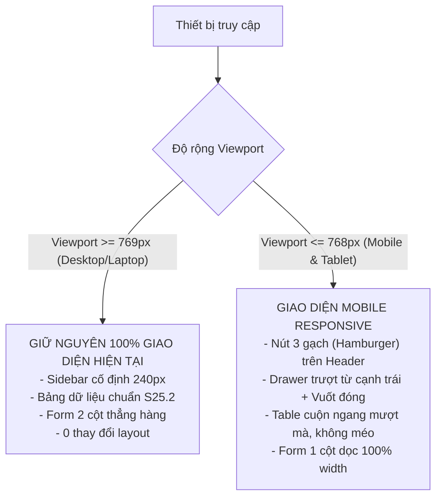

# 📱 PIM Tool Mobile Responsive Specification & Delivery Plan
> **Dự án:** PIM Tool Frontend (`pim-front`)  
> **Mục tiêu:** Tối ưu hóa trải nghiệm 100% Responsive trên Thiết bị Di động (Mobile Phones & Tablets) với nguyên tắc sống còn **ZERO DESKTOP REGRESSION** (không suy thoái giao diện Desktop hiện tại).  
> **Trạng thái:** Sẵn sàng thực thi (`Ready for /goal implementation`)  

---

## 1. 🎯 Nguyên Tắc Sống Còn (Guiding Principles)



1. **Zero Desktop Regression (Không ảnh hưởng giao diện Desktop):**
   - Mọi quy tắc CSS cho Mobile bắt buộc phải được đóng gói bên trong `@media (max-width: 768px)` và `@media (max-width: 480px)`.
   - Tuyệt đối không sửa đổi các selector gốc của màn hình Desktop trong [`src/styles/global.css`](file:///C:/Users/dptn/Downloads/pim-front%201/pim-front/src/styles/global.css).
2. **Mobile First Ergonomics (Công thái học trên di động):**
   - Vùng bấm tối thiểu (Touch Target): $\ge 44 \times 44\text{px}$ cho tất cả nút bấm, icon, checkbox và link điều hướng.
   - Tránh tuyệt đối tình trạng tràn khung ngang toàn trang (`overflow-x: hidden` trên body/root).
3. **Smooth Gestures (Trải nghiệm vuốt & chạm tự nhiên):**
   - Mở menu bằng nút 3 gạch (`fa-bars`), đóng bằng nút đóng `✕`, chạm vào lớp nền (Backdrop), hoặc **vuốt sang trái (Swipe Left)**.

---

## 2. 🧭 Kiến Trúc Navigation Bar & Mobile Drawer

### 2.1. Cấu trúc Component Header & Drawer
- **Header trên Mobile:**
  - Nút 3 gạch (Hamburger Button) xuất hiện ở góc trái đầu Header, kế bên Logo ELCA.
  - Logo ELCA thu gọn kích thước phù hợp (`32px` - `36px`).
  - Tiêu đề `"Project Information Management"` ẩn bớt chữ hoặc rút gọn thành `"PIM Tool"` trên màn hình $\le 480\text{px}$ để nhường không gian cho cụm đa ngôn ngữ `EN | FR` và nút người dùng.
- **Off-canvas Sidebar Drawer:**
  - Trạng thái mặc định trên Mobile: Ẩn hoàn toàn ra ngoài cạnh trái (`transform: translateX(-100%)`).
  - Khi mở (`.mobile-open`): Trượt mượt mà vào màn hình (`transform: translateX(0); transition: transform 0.3s ease;`), chiếm `80%` bề rộng màn hình (tối đa `300px`).
  - Lớp nền mờ (Backdrop Overlay): Làm tối nhẹ nền trang (`rgba(0, 0, 0, 0.4)`), chạm vào nền sẽ tự động đóng Drawer.
  - Tự động đóng: Chuyển trang (bấm vào `Projects list`, `New Project`, v.v.) sẽ tự động kích hoạt đóng Drawer ngay lập tức.
  - Hỗ trợ cử chỉ vuốt (Touch Gestures): Lắng nghe sự kiện `touchstart` và `touchend` với ngưỡng delta $X < -50\text{px}$ để tự động thu Drawer lại khi người dùng vuốt sang trái.

---

## 3. 📐 Thiết Kế Chi Tiết Từng Màn Hình Trên Mobile

### 3.1. Màn hình Danh sách Dự án (US02 - Project List)
1. **Thanh tìm kiếm (Search Bar):**
   - Ô nhập từ khóa (`keyword`) và dropdown trạng thái (`status`) dàn đều `width: 100%`.
   - Nút **Search Project**, liên kết **Reset Search**, và nút **Bộ lọc nâng cao (Filter icon)** xếp thành hàng nút bấm tiện lợi.
2. **Lưới lọc nâng cao (Advanced Filter Grid):**
   - Chuyển từ lưới 4 cột sang **1 cột** (hoặc 2 cột trên tablet), các ô chọn ngày `LocaleDatePicker` và chọn Leader/Member dàn đều `100%` độ rộng.
3. **Bảng dữ liệu (Data Table):**
   - Bao bọc toàn bộ thẻ `<table>` trong thẻ `div` có thuộc tính:
     ```css
     overflow-x: auto;
     -webkit-overflow-scrolling: touch;
     border-radius: 4px;
     ```
   - Các cột không bị ép nhỏ đến mức mất chữ, người dùng có thể cuộn ngang nhẹ nhàng bằng ngón tay để kiểm tra ngày tháng, khách hàng và nút xóa.
4. **Thanh công cụ xóa nổi & Phân trang:**
   - Thanh selection bar (`X items selected`) ôm sát chiều ngang màn hình.
   - Bộ phân trang căn giữa, nút trang có kích thước đủ lớn để bấm ngón tay dễ dàng.

### 3.2. Màn hình Tạo mới & Chỉnh sửa Dự án (US01 - Project Form)
1. **Bố cục Form 1 cột dọc (Single Column Layout):**
   - Chuyển `.form-row` từ hàng ngang sang hàng dọc (`flex-direction: column; align-items: flex-start`).
   - Nhãn (`label`) nằm ngay phía trên ô nhập liệu (`width: 100%; margin-bottom: 6px`).
   - Các ô nhập văn bản, dropdown Group, trạng thái, gợi ý thành viên (`MemberSuggest`) tự động co giãn `width: 100%`.
2. **Bộ chọn ngày tháng (Start Date & End Date):**
   - Trên desktop: 2 ô ngày nằm chung 1 hàng.
   - Trên mobile: Tách thành 2 dòng riêng biệt rõ ràng để tránh bị đè chữ.
   - Popup lịch `LocaleDatePicker` căn chỉnh hiển thị vừa khít trong khung nhìn điện thoại.
3. **Thanh nút bấm hành động (Action Buttons):**
   - Nút `Cancel` và `Create Project` / `Edit Project` xếp ngang hoặc dọc với `flex: 1` để bấm thuận tay cái.

---

## 4. ✅ Tiêu Chí Chấp Nhận (Acceptance Criteria)

### A. Tiêu chí Desktop (Bắt buộc không suy thoái):
- [ ] **AC-DT-01:** Trên màn hình $\ge 769\text{px}$, Sidebar hiển thị cố định bên trái (`240px`), không có nút 3 gạch Hamburger.
- [ ] **AC-DT-02:** Toàn bộ 5 test suites tự động (**31/31 tests**) tiếp tục PASS 100%.
- [ ] **AC-DT-03:** Các quy tắc căn lề bảng chuẩn S25.2 (Number căn phải, Date căn giữa, v.v.) không bị xê dịch trên Desktop.

### B. Tiêu chí Mobile:
- [ ] **AC-MB-01:** Trên màn hình $\le 768\text{px}$, Sidebar thu vào Drawer ẩn; nút 3 gạch xuất hiện trên Header.
- [ ] **AC-MB-02:** Bấm nút 3 gạch $\rightarrow$ Drawer trượt ra mượt mà kèm lớp phủ mờ; bấm nút ✕ hoặc bấm ra ngoài $\rightarrow$ Drawer đóng lại.
- [ ] **AC-MB-03:** Vuốt ngón tay sang trái trên Drawer $\rightarrow$ Drawer tự động trượt đóng lại.
- [ ] **AC-MB-04:** Bấm bất kỳ link nào trong Drawer (`Projects list`, `Project`) $\rightarrow$ chuyển trang và tự động đóng Drawer.
- [ ] **AC-MB-05:** Màn hình Project List trên mobile không bị tràn màn hình ngang; bảng dữ liệu cuộn ngang độc lập không làm vỡ trang.
- [ ] **AC-MB-06:** Màn hình Project Form trên mobile hiển thị nhãn phía trên ô nhập liệu, không bị che khuất ô nhập hoặc lỗi layout.
- [ ] **AC-MB-07:** Popup chọn ngày `LocaleDatePicker` (chọn ngày, tháng, năm) hiển thị đầy đủ trong màn hình di động.

---

## 5. 🧪 Kịch Bản Kiểm Thử Người Dùng (UAT Mobile Journeys)

| Mã UAT | Kịch bản trải nghiệm | Thao tác người dùng | Kết quả kỳ vọng |
|---|---|---|---|
| **UAT-MB-01** | Điều hướng bằng Drawer 3 gạch | 1. Mở app trên điện thoại (hoặc DevTools iPhone/Android).<br/>2. Bấm nút 3 gạch trên Header.<br/>3. Bấm "Project" (New Project). | Drawer trượt ra $\rightarrow$ Màn hình New Project mở ra và Drawer tự động đóng lại. |
| **UAT-MB-02** | Cử chỉ vuốt đóng Drawer (Swipe Left) | 1. Bấm nút 3 gạch để mở Drawer.<br/>2. Vuốt ngón tay từ phải sang trái trên bề mặt Drawer. | Drawer phản hồi mượt mà và trượt đóng về cạnh trái. |
| **UAT-MB-03** | Tìm kiếm & Cuộn bảng trên Mobile | 1. Mở danh sách dự án trên mobile.<br/>2. Gõ từ khóa tìm kiếm.<br/>3. Vuốt bảng dữ liệu sang phải để xem ngày tháng & nút xóa. | Tìm kiếm hoạt động trơn tru; bảng cuộn ngang mượt mà, không bị vỡ bố cục trang web. |
| **UAT-MB-04** | Nhập liệu & Chọn ngày năm trên Mobile | 1. Vào form New Project trên mobile.<br/>2. Điền thông tin các trường dọc.<br/>3. Bấm ô chọn năm trên lịch `LocaleDatePicker`. | Form hiển thị dọc dễ nhìn, bàn phím ảo không che khuất, bảng chọn năm/tháng thao tác dễ dàng. |

---

## 6. 📊 Ma Trận Theo Dõi Tiến Độ (Progress Tracking)

| Giai đoạn (Phase) | Nội dung công việc | File tác động chính | Trạng thái |
|---|---|---|:---:|
| **Phase 1: Skill & Spec** | Khởi tạo skill `mobile-responsive-design` và tài liệu đặc tả | `.agents/skills/mobile-responsive-design/`, `docs/` | `[DONE]` |
| **Phase 2: Layout & Drawer** | Bổ sung nút Hamburger, Drawer State, Touch Gestures & Backdrop | `Header.jsx`, `Sidebar.jsx`, `MainLayout.jsx` | `[READY]` |
| **Phase 3: Form & Table Responsive** | Viết Media Queries cho bảng cuộn ngang, form 1 cột, datepicker mobile | `src/styles/global.css` | `[READY]` |
| **Phase 4: Test & Non-Regression** | Chạy kiểm thử tự động Jest (31 tests), test đa kích thước màn hình | Test suite & Viewport checks | `[READY]` |
| **Phase 5: Deploy & Handover** | Build production, commit & push lên GitHub Vercel | GitHub Repository | `[READY]` |

---

## 7. 🚀 Quy Trình Thực Thi Với Lệnh `/goal`

Để kích hoạt hệ thống tự động triển khai toàn bộ kế hoạch trên một cách kỹ lưỡng và không dừng lại cho đến khi hoàn tất 100%, bạn chỉ cần gõ lệnh sau vào ô chat:

```bash
/goal Triển khai toàn diện Responsive Mobile cho PIM Tool theo kế hoạch MOBILE_RESPONSIVE_SPEC_AND_DELIVERY_PLAN.md
```
